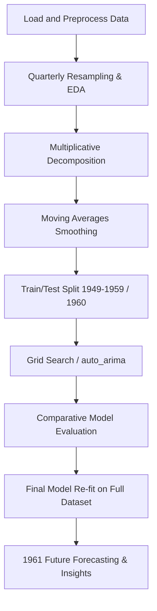
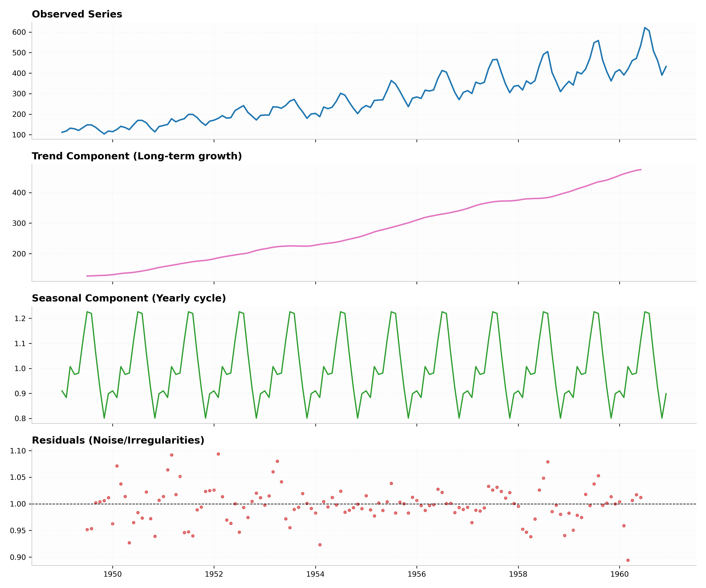
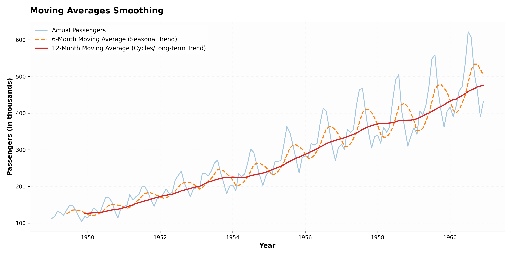
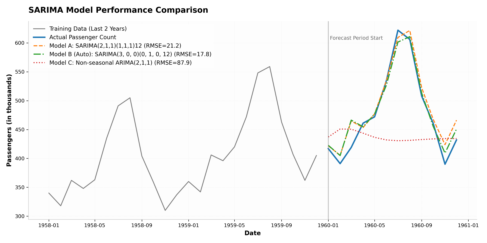
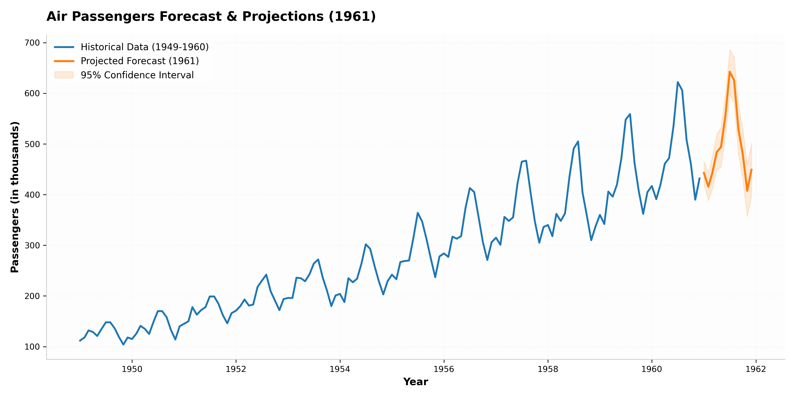

# Air Passengers Time Series Analysis & Forecasting using SARIMA

[](https://www.python.org/)
[](https://pandas.pydata.org/)
[](https://www.statsmodels.org/)
[](https://scikit-learn.org/)
[](https://matplotlib.org/)
[](LICENSE)

An end-to-end time series analysis and forecasting project demonstrating how to model and predict monthly airline passenger demand using classical statistical methods. The repository covers exploratory data analysis (EDA), moving average smoothing, multiplicative decomposition, SARIMA parameters optimization (`auto_arima`), and a 12-month-ahead forward projection (1961) with confidence intervals.

---

## 📌 Project Overview

Predicting passenger demand is a critical operational challenge for the aviation industry. This project utilizes the historic **Air Passengers dataset (1949–1960)** to extract structural components (long-term trend, annual seasonality, and irregular noise) and build a robust predictive model. We compare a custom-specified SARIMA model against a mathematically optimized model selected via Akaike Information Criterion (AIC) search, yielding a high-accuracy forecast model suitable for resource planning.

---

## 🎯 Objectives

1. **Deconstruct Time Series**: Separate the series into trend, seasonal, and residual elements using multiplicative decomposition.
2. **Smooth and Visualize**: Utilize 6-month and 12-month rolling moving averages to analyze cycles and long-term trends.
3. **Optimize Parameters**: Implement automated hyperparameter tuning (`auto_arima`) to find the best-performing Seasonal ARIMA (SARIMA) parameters.
4. **Out-of-Sample Validation**: Backtest forecasts on a 12-month holdout test partition and evaluate using RMSE and MAPE.
5. **Business Forecast**: Project passenger demand for 1961 to provide data-backed operational insights.

---

## 📊 Dataset Description

- **Name**: Classic Box & Jenkins Air Passengers Dataset
- **Scope**: Monthly airline passengers from **January 1949 to December 1960** (144 observations).
- **Features**: 
  - `Month`: Date index (Format: `YYYY-MM`)
  - `Passengers`: Count of passengers (in thousands)
- **Characteristics**: Clear upward secular trend and expanding (multiplicative) annual seasonality.

---

## 🛠️ Technologies Used

- **Language**: Python 3.9+
- **Data Manipulation**: `Pandas`, `NumPy`
- **Statistical Modeling**: `Statsmodels` (SARIMAX, seasonal_decompose)
- **Automated Parameter Tuning**: `pmdarima` (auto_arima)
- **Model Evaluation**: `Scikit-learn` (mean_squared_error, mean_absolute_percentage_error)
- **Data Visualization**: `Matplotlib`

---

## 🔄 Project Workflow



---

## 📈 Time Series Analysis & Decomposition

### 1. Multiplicative Decomposition
By decomposing the dataset ($\text{Observed} = \text{Trend} \times \text{Seasonal} \times \text{Residual}$), we capture:
- **Trend**: Consistent, non-linear long-term upward growth (**3.75x** expansion over 12 years).
- **Seasonality**: Highly recurrent annual cycle peaking in **July** (factor: 1.23) and troughing in **November** (factor: 0.80).

### 2. Moving Average Analysis
- **12-Month Moving Average**: Exposes the pure secular trend line by stripping away seasonal noise.
- **6-Month Moving Average**: Smooths the series while preserving the bi-annual trajectory, highlighting peak and trough transitions.

---

## 🤖 SARIMA Forecasting

We implemented a **Seasonal Autoregressive Integrated Moving Average (SARIMA)** model, represented as $\text{SARIMA}(p, d, q) \times (P, D, Q)_s$. We evaluated three model designs on a 12-month test set:

1. **Model A (Manual)**: $\text{SARIMA}(2,1,1)(1,1,1)_{12}$
2. **Model B (Auto-selected)**: $\text{SARIMA}(3,0,0)(0,1,0)_{12}$ with intercept (Optimized via stepwise AIC search)
3. **Model C (Baseline)**: Non-seasonal $\text{ARIMA}(2,1,1)$

---

## 📏 Model Evaluation & Results

The models were fitted on the first 11 years (132 months) and tested against the final year (1960). The results are summarized below:

| Model Description | Test RMSE | Test MAPE | AIC Score | Selection Status |
| :--- | :---: | :---: | :---: | :---: |
| **Model A**: SARIMA$(2,1,1)(1,1,1)_{12}$ | 21.15 | 3.67% | **903.4** | Candidate |
| **Model B**: SARIMA$(3,0,0)(0,1,0)_{12}$ | **17.82** | **2.97%** | 911.9 | **Selected (Best Performance)** |
| **Model C**: ARIMA$(2,1,1)$ [Non-seasonal] | 87.88 | 12.54% | 1246.3 | Rejected (No Seasonal Fitting) |

### 💡 Key Findings
- **Seasonal Modeling is Vital**: Excluding seasonal parameters (Model C) leads to a massive **393% increase** in RMSE.
- **Auto-SARIMA Superiority**: Model B achieved a **MAPE of 2.97%** (average error of ~14 passengers), making it highly reliable for operational deployment.

---

## 🖼️ Visualizations

### 🔍 Seasonal Decomposition
Separating the passenger data into Observed, Trend, Seasonal, and Residual components.


### 📉 Moving Averages
Smooths out short-term fluctuations to reveal underlying patterns.


### 🎯 Test Forecast vs. Actual
Comparison of the predictions made by all three candidate models against the actual passenger figures of 1960.


### 🔮 1961 Future Projections
Twelve-month out-of-sample forecast for 1961, generated using the final SARIMA model fitted on the entire dataset.


---

## 💼 Business Applications & Recommendations

1. **Strategic Scaling (Q3 Peak)**: July traffic is projected to peak at **642.5 passengers**, which is ~30% higher than the yearly average. Operations should increase flight capacities, staff scheduling, and ground handling resources by **25%–30%** in Q3 compared to winter baselines.
2. **Dynamic Pricing (Q4 Lows)**: November represents the seasonal trough (**407.7 passengers**). Marketing and commercial teams should deploy promotional campaigns and travel packages between November and February to stimulate demand and optimize fleet utilization.
3. **Long-term Growth CAGR**: The passenger CAGR from 1954 to 1960 was **12.18%**. This indicates strong industry health and supports multi-year fleet acquisition planning.

---

## 📁 Project Structure

```text
├── airline-passengers.csv      # Raw Monthly Passenger Dataset (1949-1960)
├── analysis.py                 # Core Python Pipeline (Data Prep -> Modeling -> Forecasting)
├── decomposition.png           # Visual: Time Series Decomposition Plot
├── moving_averages.png         # Visual: Moving Averages Smoothing Plot
├── forecast_vs_actual.png      # Visual: Test Forecast Validation Plot
├── future_forecast.png         # Visual: 1961 Forward Forecast Projections Plot
├── report.md                   # Detailed Executive Business Report
└── README.md                   # Project Documentation
```

---

## 🚀 Installation & Usage

### 1. Clone the Repository
```bash
git clone https://github.com/yourusername/air-passengers-forecasting.git
cd air-passengers-forecasting
```

### 2. Set Up Virtual Environment
```bash
python3 -m venv .venv
source .venv/bin/activate
```

### 3. Install Dependencies
```bash
pip install --upgrade pip
pip install pandas numpy matplotlib statsmodels scikit-learn pmdarima
```

### 4. Run the Analysis
```bash
python analysis.py
```
*Running the script will print the metrics comparison table and output the four analysis plots (`.png`) in the project directory.*

---

## ✅ Skills Demonstrated

- **Time Series Analysis**: Resampling, rolling windows, trend/seasonality decomposition, stationarity concepts.
- **Statistical Modeling**: Seasonal ARIMA (SARIMA), hyperparameter grid search (AIC optimization).
- **Validation Techniques**: Out-of-sample temporal validation (backtesting), model selection.
- **Evaluation Metrics**: Regression evaluation using RMSE, MAPE.
- **Reporting & Business Analysis**: Translating technical regression forecasts into actionable business strategies.

---

## 🏁 Conclusion

By using SARIMA modeling, we successfully captured the complex interactions of trend and seasonality present in the Air Passengers dataset. Automated parameter selection using `pmdarima` allowed us to find a highly accurate model (MAPE = 2.97%) that provides solid predictive utility for forecasting passenger demand.

---

## 👤 Author

- **Your Name**
- [LinkedIn Profile](https://linkedin.com/in/yourusername)
- [GitHub Profile](https://github.com/yourusername)
- [Portfolio Website](https://yourportfolio.com)
